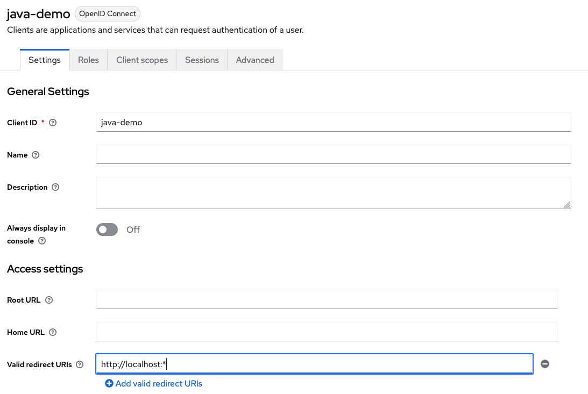

# OIDC Java Fat-Client Demo

This repository contains a small demo about how to authenticate a java client application
with [OpenID Connect](https://openid.net/connect/) and
the [OAuth2 Authorization Code Flow with PKCE](https://www.rfc-editor.org/rfc/rfc7636).

It was part of my Talk at the JUG Nürnberg. The slides are available on SlideShare: 

<https://www.slideshare.net/QAware/anwendungsbergreifende-authentifizierung-integrationspattern-fr-openid-connect>

## Run the demo

### Keycloak Setup

1. Start keycloak locally using docker or podman as described in the Keycloak
   documentation: <https://www.keycloak.org/getting-started/getting-started-docker#_start_keycloak>
2. Login into the admin console
3. Create a new OIDC Client named `java-demo`:
   
   and
   
4. Add the redirect uri `http://localhost:*`:  
   

### Run Demo

Run the class `de.chrfritz.oidc.auth.CliTestClient` in `src/test/java`. The example shows the
Run-Configuration for IntelliJ:

Then a browser window should be opened:

After a successful login, you should see that the demo got a valid access token and got the
information from the user info endpoint:

## Maintainer

Christian Fritz (@chrfritz), <christian.fritz@qaware.de>

## License

This software is provided under the MIT open source license, read the [`LICENSE`](LICENSE)
file for details.
